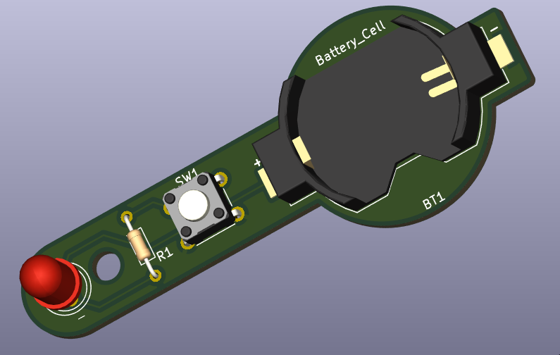
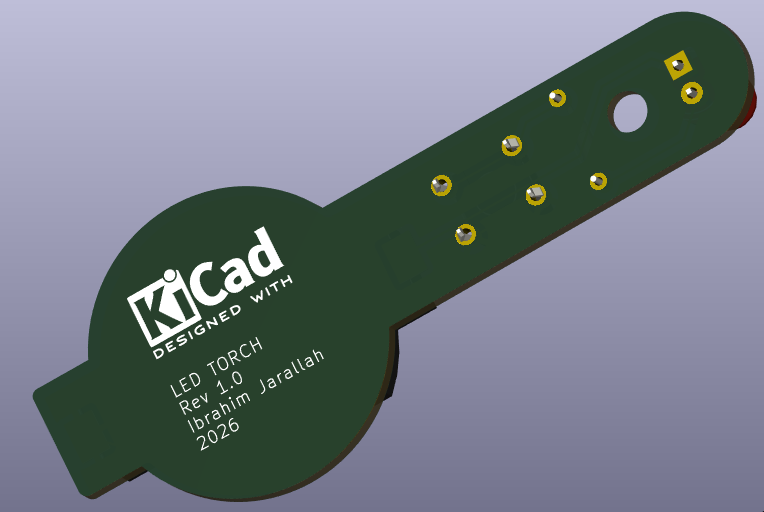
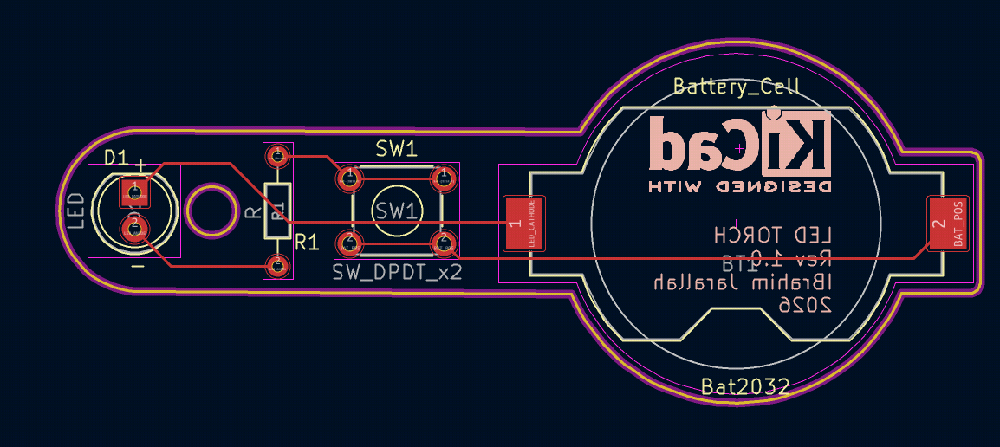
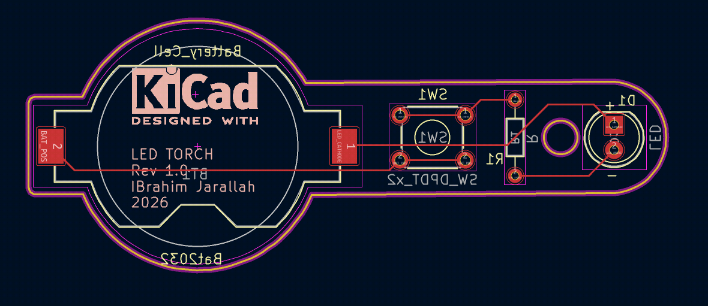
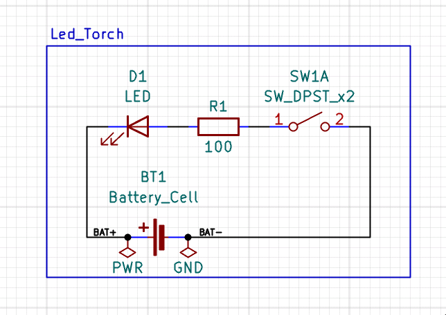

# LED Torch — CR2032 Coin Cell PCB

> A compact, battery-powered LED torch circuit built around a CR2032 coin cell.  
> Minimal BOM, DPST tactile switch control, and a current-limited 5mm LED.  
> Designed and laid out in **KiCad 9.0** — schematic + 2-layer PCB with full fabrication outputs.

---

## 📸 3D Views

| Front | Back |
|:---:|:---:|
|  |  |

## 🖼️ PCB Layout (2D)

| Front | Back |
|:---:|:---:|
|  |  |

## 📐 Schematic



---

## ⚡ Specifications

| Parameter            | Value                            |
|----------------------|----------------------------------|
| Supply Voltage       | 3V DC (CR2032 coin cell)         |
| LED Forward Voltage  | ~2V (typical 5mm LED)            |
| Current Limit        | ~10mA (R1 = 100Ω)               |
| Switch               | DPST tactile (Omron B3F series)  |
| PCB Layers           | 2                                |
| Designed With        | KiCad 9.0.7                      |

---

## 🔧 How It Works

### 1. Power Source
A **CR2032 coin cell** (BT1) provides **3V DC**. The Keystone 1058 holder allows easy battery replacement.

### 2. Switch Control
**SW1** is an **Omron B3F DPST tactile switch** wired to connect/disconnect the circuit.  
Pressing SW1 completes the circuit and powers the LED.

### 3. Current Limiting
**R1 (100Ω)** limits the LED current to a safe level:

```
I = (Vbat - Vf) / R1 = (3V - 2V) / 100Ω ≈ 10mA
```

This keeps the CR2032 within its continuous discharge rating while delivering adequate brightness.

### 4. LED Output
**D1** is a standard **5mm through-hole LED** — visible indicator/torch output.

---

## 📦 Bill of Materials

| ID | Designator | Description | Quantity | Footprint |
|----|------------|-------------|----------|-----------|
| 1 | BT1 | CR2032 Coin Cell Battery Holder | 1 | Keystone 1058 1×CR2032 |
| 2 | D1 | LED 5mm | 1 | LED_D5.0mm |
| 3 | R1 | Resistor 100Ω | 1 | Axial DIN0204 L3.6mm P7.62mm |
| 4 | SW1 | Tactile Switch DPST (Omron B3F) | 1 | SW_TH_Tactile_Omron_B3F-100x |

---

## 📁 Repository Structure

```
Led_Torch/
├── Led_Torch.kicad_pro          # KiCad project file
├── Led_Torch.kicad_sch          # Schematic
├── Led_Torch.kicad_pcb          # PCB layout
├── Led_Torch.xml                # KiCad XML component data
├── BOM/
│   └── Led_Torch.csv            # Bill of materials
├── Netlist/
│   └── Led_Torch.net            # Netlist
├── Gerbers+drills/              # Fabrication Gerber + drill files
│   ├── Led_Torch-F_Cu.gbr
│   ├── Led_Torch-B_Cu.gbr
│   ├── Led_Torch-F_Mask.gbr
│   ├── Led_Torch-B_Mask.gbr
│   ├── Led_Torch-F_Silkscreen.gbr
│   ├── Led_Torch-B_Silkscreen.gbr
│   ├── Led_Torch-F_Paste.gbr
│   ├── Led_Torch-B_Paste.gbr
│   ├── Led_Torch-F_Fab.gbr
│   ├── Led_Torch-B_Fab.gbr
│   ├── Led_Torch-Edge_Cuts.gbr
│   ├── Led_Torch-PTH-drl.gbr
│   ├── Led_Torch-NPTH-drl.gbr
│   └── Led_Torch-job.gbrjob
├── drills/                      # Drill files (if separate)
├── 2d_view/
│   ├── 2d_view_Front.png
│   └── 2d_view_Back.png
├── 3d_view/
│   ├── 3d_view_front.png
│   └── 3d_view_back.png
├── Schematic_view/
│   ├── schematic_view.png
│   └── Led_Torch.pdf
├── pdf_assembly/
│   ├── Led_Torch-F_Cu.pdf
│   ├── Led_Torch-F_Fab.pdf
│   └── Led_Torch-F_Silkscreen.pdf
└── STEP_3d/
    └── Led_Torch.step           # 3D STEP model for mechanical integration
```

---

## 🖥️ Opening the Project

1. Install [KiCad 9.0+](https://www.kicad.org/download/)
2. Clone this repository:
   ```bash
   git clone https://github.com/ibrahimjarallah/Led_Torch.git
   ```
3. Open `Led_Torch.kicad_pro` in KiCad

---

## 🏭 Fabrication

All fabrication outputs are ready in the `Gerbers+drills/` folder.  
Compatible with standard PCB manufacturers (JLCPCB, PCBWay, OSHPark, etc.).

- Load `Led_Torch-job.gbrjob` directly into any Gerber viewer or fab upload portal
- PTH and NPTH drill files provided in Gerber format

---

## 🧩 3D Model

A **STEP file** is available in `STEP_3d/Led_Torch.step` for mechanical enclosure design and CAD integration (SolidWorks, FreeCAD, Fusion 360, etc.).

---

## ⚠️ Notes

- CR2032 typical capacity: ~220mAh → at 10mA continuous, runtime ≈ **22 hours**
- For longer battery life, reduce R1 to 220Ω (≈4.5mA) or add a PWM dimmer stage
- LED polarity must be observed during assembly — anode to R1, cathode to GND

---

## 📄 License

This project is licensed under the **MIT License**.  
You are free to use, modify, and distribute it with attribution.

---

## 👤 Author

**Ibrahim Jarallah**  
GitHub: [ibrahimjarallah](https://github.com/ibrahimjarallah) \
LinkedIn: [ibrahimjarallah](https://www.linkedin.com/in/ibrahim-jarallah)
